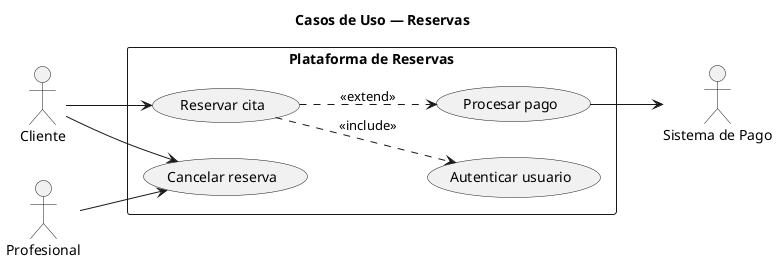
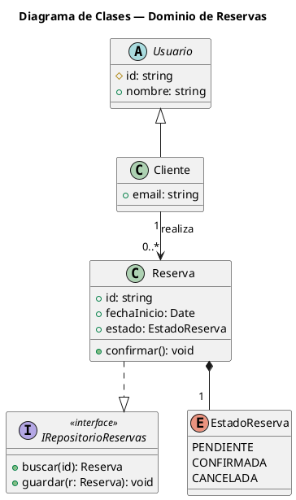
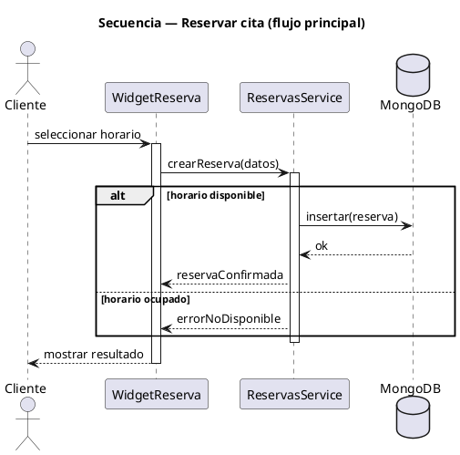
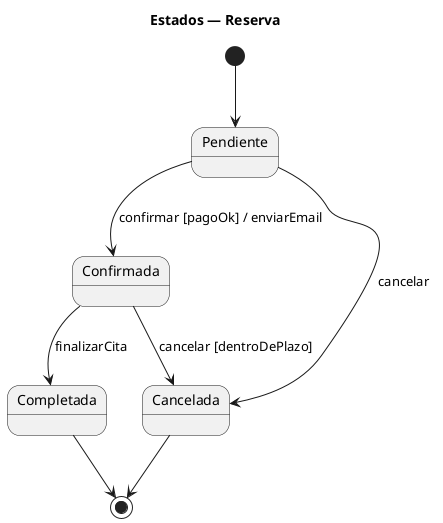
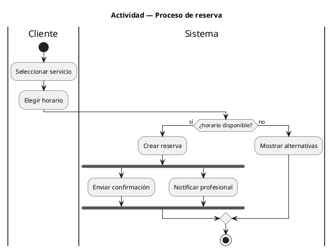
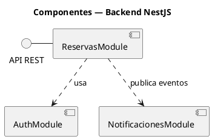
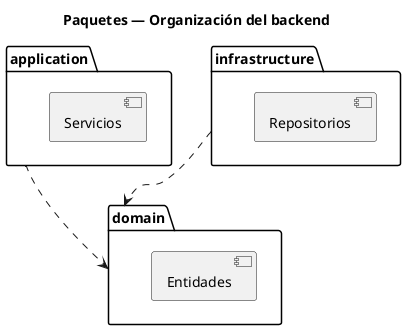
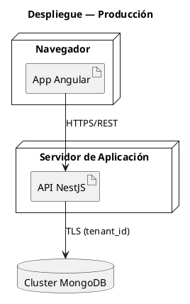

# Regla: Sintaxis de PlantUML para diagramas UML

Esta regla define **cómo** escribir en PlantUML cada diagrama UML que pide la regla `uml-rup.md`.
Decide *qué* diagrama crear con `uml-rup.md`; usa *esta* regla para escribirlo.

## 1. Reglas generales del archivo `.puml`

- Todo diagrama empieza con `@startuml` y termina con `@enduml`.
- Pon un **título** descriptivo: `title Diagrama de Casos de Uso — Gestión de reservas`.
- Un archivo `.puml` por diagrama; nómbralo por su contenido y vista, p. ej. `logical_view/clases_reserva.puml`.
- Añade el bloque de estilo común al inicio para uniformidad:

```plantuml
@startuml
' --- estilo base del proyecto ---
skinparam shadowing false
skinparam defaultFontName "Helvetica"
skinparam backgroundColor White
skinparam ArrowColor #333333
skinparam linetype ortho
left to right direction
' --------------------------------
@enduml
```

- Comentarios con comilla simple `'` (línea) o `/' ... '/` (bloque).
- Idioma de etiquetas: **español** (coherente con `uml-rup.md`).
- Prefiere `!theme plain` o el `skinparam` anterior antes que estilos ad hoc.

## 2. Casos de Uso



- Actores: `actor "Nombre" as alias`.
- Casos de uso: `usecase "Verbo + objeto" as alias` dentro de un `rectangle "Sistema"`.
- Relaciones: asociación `-->`; `..> : <<include>>`; `..> : <<extend>>`; generalización `--|>`.

## 3. Clases



- Visibilidad: `+` público, `-` privado, `#` protegido, `~` paquete.
- Relaciones: asociación `-->`, herencia `--|>` (o `extends`), realización `..|>`, dependencia `..>`, composición `*--`, agregación `o--`.
- Multiplicidad entre comillas: `"1"`, `"0..*"`, `"1..*"`.
- Estereotipos `<<interface>>`; clases abstractas con `abstract class`.

## 4. Secuencia



- Mensaje síncrono `->`, retorno `-->`, asíncrono `->>`.
- Activaciones con `activate`/`deactivate` (o `++`/`--` en la flecha).
- Fragmentos: `alt`/`else`/`end`, `opt`/`end`, `loop`/`end`, `par`/`end`.
- Tipos de línea de vida: `actor`, `participant`, `database`, `boundary`, `control`, `entity`.

## 5. Máquina de Estados



- Estado inicial `[*] -->`, estado final `--> [*]`.
- Transición: `Origen --> Destino : evento [guarda] / acción`.
- Estados compuestos con `state Nombre { ... }`.

## 6. Actividad (sintaxis nueva, recomendada)



- Inicio `start`, fin `stop`/`end`.
- Acción `:texto;`.
- Decisión `if (cond?) then (etiqueta) ... else (etiqueta) ... endif`.
- Concurrencia `fork` / `fork again` / `end fork`.
- Calles (swimlanes) con `|Nombre|`.

## 7. Componentes



- Componente: `component "Nombre" as alias` (o `[Nombre]`).
- Interfaz provista `- ` (bola); requerida `..>` (zócalo/dependencia).

## 8. Paquetes



- Paquete: `package "Nombre" { ... }`.
- Dependencia entre paquetes con `..>`. Evita ciclos.

## 9. Despliegue



- Nodos: `node`, `cloud`, `database`; artefactos con `artifact`.
- Etiqueta cada conexión con su **protocolo**.

## 10. Buenas prácticas de estilo

- Usa **alias cortos** (`as svc`) y reutilízalos; evita renombrar el mismo elemento.
- Mantén la dirección legible: `left to right direction` para casos de uso/componentes; vertical por defecto en secuencia/estados.
- Agrupa con `package`/`rectangle`/`node` para reducir cruces de líneas.
- Si un diagrama queda ilegible, **divídelo** (coherente con "una intención por diagrama" de `uml-rup.md`).
- Renderiza con `plantuml diagrama.puml` (requiere Java + Graphviz) o la extensión PlantUML del IDE; versiona el `.puml` fuente junto a la imagen exportada.
