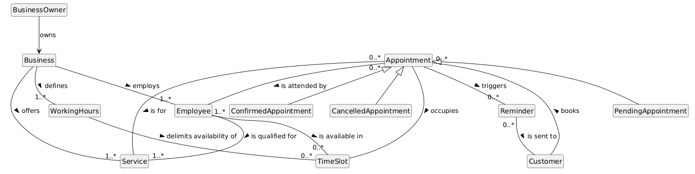

[<- Volver al README principal](../readme.md)

## 1. Descripción general del producto

El proyecto consiste en el diseño, desarrollo e implementación de una plataforma de software como servicio (**SaaS**) bajo una arquitectura **Multitenant** (Multi-inquilino). El sistema está concebido para permitir que múltiples negocios independientes (clínicas, barberías, consultorías, centros estéticos, etc.), denominados **Tenants**, gestionen de forma autónoma sus agendas, recursos humanos y catálogos de servicios utilizando una única infraestructura de aplicación y base de datos compartida.

El núcleo innovador del proyecto radica en su enfoque de desarrollo: se utilizarán herramientas de **Inteligencia Artificial** (como asistentes de código y generadores de lógica) para acelerar la escritura de código, algoritmos de disponibilidad y pruebas automatizadas, garantizando que el valor del producto final resida puramente en su sólida arquitectura de software, el aislamiento estricto de datos, la resiliencia del sistema y la experiencia de usuario.

La plataforma ofrecerá tres interfaces claramente diferenciadas:
* **Panel de Control Global (Super-Admin):** Para la administración y monetización del SaaS.
* **Backoffice del Negocio (Tenant Admin / Empleado):** Para la gestión operativa y visualización de la agenda mediante componentes interactivos.
* **Portal Público de Reserva (Widget):** Optimizado para dispositivos móviles, que permitirá a los clientes finales agendar citas sin fricciones y con mecanismos de seguridad integrados.

## 2. Objetivo del Proyecto

El objetivo principal es implementar un sistema de reservas escalable, seguro y altamente disponible que resuelva los problemas logísticos de agendamiento y la pérdida de ingresos por incomparecencia (*no-shows*) en microempresas y profesionales autónomos.

### Objetivos Técnicos Específicos:
* **Aislamiento de Datos (Multi-tenancy):** Garantizar la seguridad de la información mediante una arquitectura de datos que impida de forma absoluta la fuga de datos entre diferentes Tenants.
* **Optimización del Algoritmo de Disponibilidad:** Desarrollar un motor lógico capaz de calcular en tiempo real los huecos libres cruzando múltiples variables concurrentes (horarios del negocio, turnos, capacidad del empleado, duración del servicio y citas existentes).
* **Interoperabilidad:** Integrar el sistema con proveedores externos líderes mediante APIs (OAuth2 para Google Calendar y pasarelas de comunicación para alertas automáticas).
* **Demostración de Eficiencia con IA:** Validar un flujo de trabajo moderno donde la arquitectura es diseñada por el ingeniero y el código es generado, optimizado y documentado eficientemente mediante herramientas de IA.

## 3. Modelo del dominio y glosario de términos

El diagrama anterior representa las entidades principales del dominio de reservas: negocios, propietarios, empleados, clientes, servicios, horarios, huecos disponibles, citas, recordatorios y los estados posibles de una cita.

Para ampliar el significado de los conceptos del dominio y consultar los términos relacionados que quedan fuera del diagrama, ver el [glosario de términos](../system_architecture/domain_model/glossary.txt).

## 4. Características y Funcionalidades Principales

### A. Módulo de Arquitectura Core y Onboarding (SaaS Multitenant)
* **Aislamiento y Enrutamiento por Subdominio:** El sistema identificará el Tenant a través de la URL de la petición (ej. `nombre-negocio.plataforma.com`). Un middleware interceptará la solicitud para resolver el contexto del negocio y asegurar que las consultas a la base de datos incluyan de forma estricta el filtro de su identificador único (`tenant_id`).
* **Registro Automatizado (Onboarding):** Flujo de autoservicio donde un nuevo negocio puede darse de alta, validar su correo electrónico y desplegar instantáneamente su portal público y privado sin intervención manual.

### B. Módulo de Configuración y Motores Lógicos (Panel del Tenant)
* **Motor de Reglas de Disponibilidad:** Interfaz para parametrizar la capacidad operativa del negocio. Permite configurar jornadas laborales partidas o continuas, definir días festivos o bloqueos manuales de agenda, y establecer tiempos de colchón (*buffer times*) obligatorios entre citas.
* **Gestión de Entidades Relacionales (Servicios y Empleados):**
  * **Catálogo de Servicios:** Registro con campos de nombre, descripción, precio, categoría y duración exacta en minutos.
  * **Staff/Personal:** Gestión de perfiles de empleados, asignación de los servicios que están capacitados para realizar y personalización de sus horarios individuales de trabajo.

### C. Módulo de Reserva Pública y Seguridad (Widget del Cliente Final)
* **Widget de Reserva Responsivo:** Interfaz pública ultra-limpia que guía al usuario en un flujo de tres pasos: Selección de Servicio $\rightarrow$ Selección de Profesional $\rightarrow$ Selección de Fecha y Hora disponible en el calendario dinámico.
* **Sistema de Verificación Anti-Spam (Mecanismo OTP):** Para evitar ataques de denegación de servicio lógicos (bloqueo intencionado de agendas mediante citas falsas), la reserva se almacenará en un estado "Temporal". El sistema enviará un código numérico de un solo uso (One-Time Password) al correo o teléfono del cliente. Si no se introduce en el tiempo límite, el hueco se liberará automáticamente.

### D. Módulo de Gestión Operativa, Sincronización y Alertas
* **Calendario Interactivo "Drag & Drop":** El panel principal del negocio contará con una agenda visual interactiva. Los administradores podrán arrastrar una cita para cambiarla de hora o día de forma visual con validación en background.
* **Sincronización Bidireccional (Google Calendar API):** Integración mediante protocolo OAuth2 para que las citas se sincronicen automáticamente con el calendario personal del empleado y viceversa.
* **Motor de Notificaciones Programadas (Cron Jobs):** Servicio en segundo plano que evalúa periódicamente las citas de las próximas 24 horas y envía de forma automatizada recordatorios personalizados vía Email o WhatsApp.

### E. Módulo de Administración Global (Super-Admin)
* **Consola de Control del SaaS:** Dashboard centralizado accesible únicamente por los propietarios de la plataforma para monitorizar la salud del negocio: número de tenants activos, volumen total de citas procesadas por mes y control de ciclos de facturación o suspensión de cuentas.
