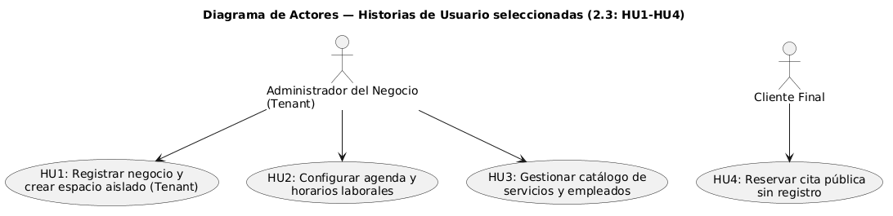
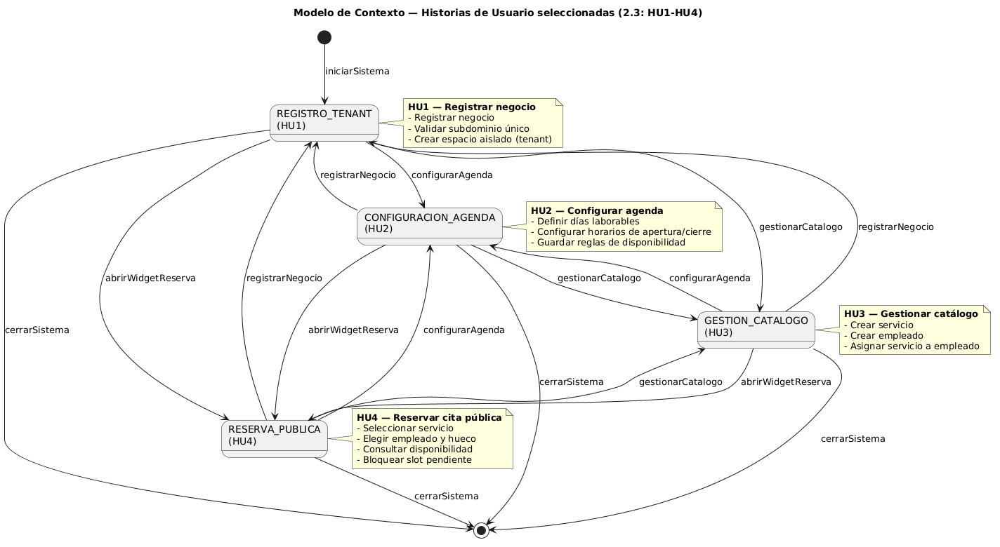
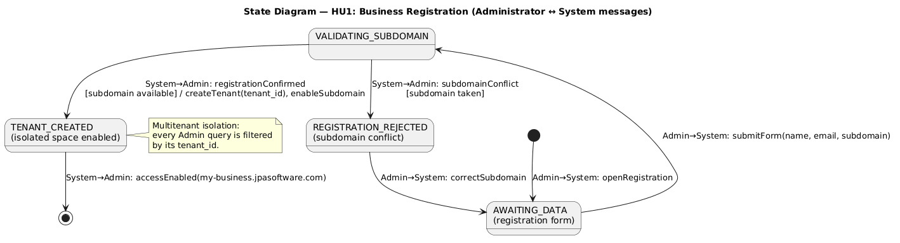
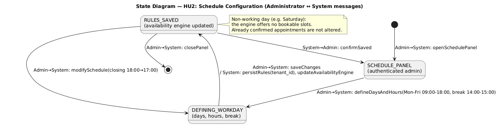
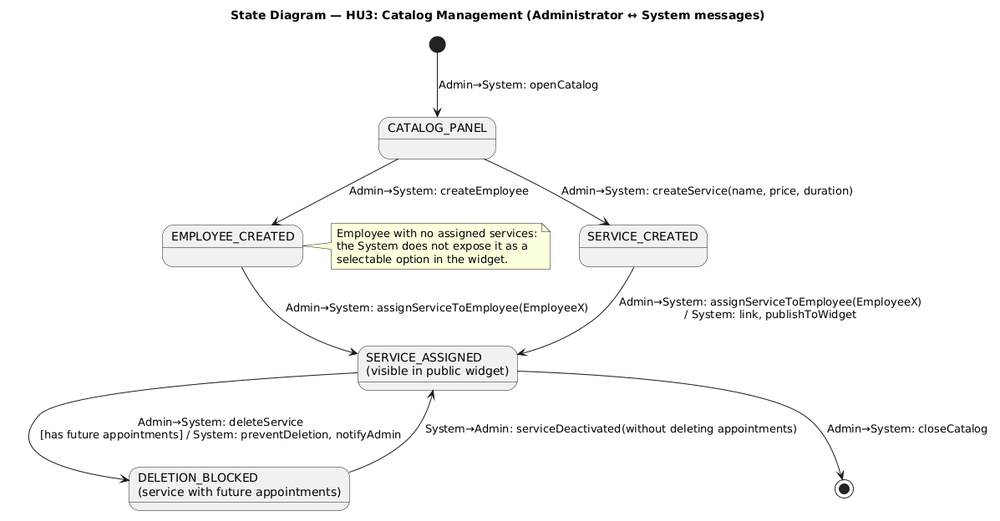
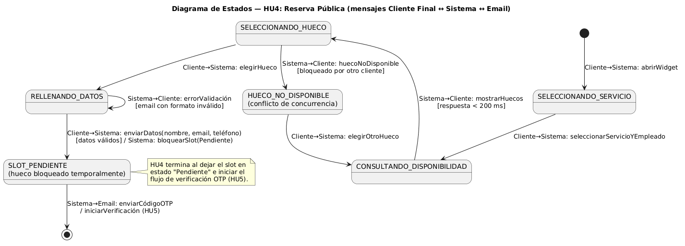

[<- Volver al README principal](../readme.md)

## 2. Historias de Usuario

### 2.1 Catálogo global de historias de usuario

### Épica 1: Onboarding y Configuración (Tenant / Dueño de Negocio)

#### HU1: Registro de Negocio y Creación de Espacio Aislado (Tenant)

* **Como** emprendedor o dueño de un negocio,
* **quiero** registrarme en la plataforma indicando los datos de mi negocio y un subdominio único,
* **para** disponer de un portal de reservas personalizado y aislado de otros comercios.

**Cumplimiento INVEST:** Historia independiente y acotada al alta de tenant; la validación de email y el DNS wildcard son negociables en implementación.

**Criterios de Aceptación (BDD):**

*Escenario: Alta exitosa con subdominio disponible*
* **Dado** que soy un usuario no registrado con datos válidos (nombre del negocio, email corporativo y subdominio deseado)
* **Cuando** envío el formulario de registro y el subdominio no está en uso
* **Entonces** el sistema crea el tenant con un `tenant_id` único, persiste los datos asociados y habilita el acceso a `mi-negocio.tuplataforma.com`

*Escenario: Subdominio ya ocupado*
* **Dado** que intento registrar el subdominio `barberia-paco`
* **Cuando** ese subdominio ya pertenece a otro tenant
* **Entonces** el sistema rechaza el alta, muestra un mensaje de conflicto y no crea ningún registro parcial

*Escenario: Aislamiento de datos entre tenants*
* **Dado** que existen al menos dos tenants activos
* **Cuando** un administrador del Tenant A consulta sus datos
* **Entonces** el sistema solo devuelve documentos filtrados por el `tenant_id` del Tenant A

| Dimensión | Estimación |
| :--- | :--- |
| Impacto en el usuario y valor del negocio | **Muy alto.** Habilita el onboarding autoservicio y la propuesta de valor multitenant; sin esto no hay ingresos ni adopción. |
| Urgencia (mercado y feedback) | **Alta.** El mercado de scheduling SaaS exige time-to-value en minutos; es el primer paso del funnel de conversión B2B. |
| Complejidad y esfuerzo | **Alta.** Middleware de resolución por subdominio, modelo multitenant, validaciones y enrutamiento wildcard. |
| Riesgos y dependencias | Fuga inter-tenant (crítico), configuración DNS/proxy. **Dependencias:** ninguna (historia raíz). |
| Tiempo de desarrollo estimado | **8–12 días** |

**Prioridad:** **Crítica**

---

#### HU2: Configuración de la Agenda y Horarios Laborales

* **Como** administrador de mi negocio,
* **quiero** definir los días laborables, horarios de apertura/cierre y turnos de descanso,
* **para** que los clientes solo puedan reservar en los huecos operativos de mi negocio.

**Cumplimiento INVEST:** Acotada a reglas de disponibilidad del negocio (no incluye festivos ni buffers, negociables en iteraciones posteriores). Depende de HU1.

**Criterios de Aceptación (BDD):**

*Escenario: Configuración de jornada con descanso*
* **Dado** que estoy autenticado como administrador del tenant en el panel de horarios
* **Cuando** configuro Lunes a Viernes de 09:00 a 18:00 con descanso de 14:00 a 15:00 y guardo los cambios
* **Entonces** el sistema persiste las reglas vinculadas al `tenant_id` y el motor de disponibilidad excluye huecos fuera de ese rango y durante el descanso

*Escenario: Día no laborable*
* **Dado** que el sábado está marcado como día no laborable
* **Cuando** un cliente consulta disponibilidad para un sábado
* **Entonces** el sistema no ofrece ningún hueco reservable ese día

*Escenario: Modificación de horario existente*
* **Dado** que ya existen reglas de horario guardadas
* **Cuando** actualizo el cierre de 18:00 a 17:00
* **Entonces** las nuevas consultas de disponibilidad reflejan el horario actualizado sin afectar citas ya confirmadas

| Dimensión | Estimación |
| :--- | :--- |
| Impacto en el usuario y valor del negocio | **Alto.** Evita reservas fuera de horario y reduce fricción operativa del tenant. |
| Urgencia (mercado y feedback) | **Alta.** Competidores (Calendly, Fresha) ofrecen configuración de horarios desde el día uno. |
| Complejidad y esfuerzo | **Media.** CRUD de reglas + integración con el motor de disponibilidad. |
| Riesgos y dependencias | Lógica de solapamiento de rangos. **Dependencias:** HU1. |
| Tiempo de desarrollo estimado | **5–7 días** |

**Prioridad:** **Alta**

---

#### HU3: Gestión del Catálogo de Servicios y Empleados

* **Como** administrador de mi negocio,
* **quiero** dar de alta servicios (nombre, precio, duración) y empleados, asignando qué empleado puede realizar cada servicio,
* **para** que el portal público muestre una oferta clara y reserve solo con personal capacitado.

**Cumplimiento INVEST:** Reducida para mantenerla *Small*: incluye CRUD básico y asignación servicio–empleado; horarios individuales por empleado quedan fuera (iteración futura).

**Criterios de Aceptación (BDD):**

*Escenario: Alta de servicio y asignación a empleado*
* **Dado** que creo el servicio "Corte de pelo" con duración de 30 minutos y precio definido
* **Cuando** lo asigno al Empleado X y guardo
* **Entonces** el servicio queda visible en el catálogo del tenant y vinculado al Empleado X

*Escenario: Disponibilidad cruzada servicio–empleado*
* **Dado** que el servicio "Corte de pelo" está asignado solo al Empleado X
* **Cuando** un cliente consulta huecos para ese servicio en el widget público
* **Entonces** el sistema calcula disponibilidad usando la agenda del Empleado X y la duración de 30 minutos

*Escenario: Empleado sin servicios asignados*
* **Dado** que el Empleado Y no tiene ningún servicio vinculado
* **Cuando** un cliente navega el widget de reservas
* **Entonces** el Empleado Y no aparece como opción seleccionable

*Escenario: Eliminación lógica de servicio activo*
* **Dado** que un servicio tiene citas futuras confirmadas
* **Cuando** intento eliminarlo del catálogo
* **Entonces** el sistema impide la eliminación o la desactiva sin borrar citas existentes, informando al administrador

| Dimensión | Estimación |
| :--- | :--- |
| Impacto en el usuario y valor del negocio | **Alto.** Sin catálogo y staff no hay reservas significativas; define la oferta comercial del tenant. |
| Urgencia (mercado y feedback) | **Alta.** Feedback habitual de microempresas: necesitan cargar servicios y equipo en el primer día de uso. |
| Complejidad y esfuerzo | **Media-alta.** Relaciones servicio–empleado, validaciones y exposición en widget. |
| Riesgos y dependencias | Integridad referencial al borrar entidades. **Dependencias:** HU1, HU2. |
| Tiempo de desarrollo estimado | **6–9 días** |

**Prioridad:** **Alta**

---

### Épica 2: Flujo del Cliente Final

#### HU4: Reserva Pública de Citas sin Registro (Widget de Reserva)

* **Como** cliente final de un negocio,
* **quiero** reservar una cita desde el portal público eligiendo servicio, empleado y fecha/hora sin crear una cuenta con contraseña,
* **para** completar mi cita en pocos pasos desde el móvil.

**Cumplimiento INVEST:** Valor directo al usuario B2C; independiente de login tradicional. Depende de HU1–HU3 para datos y disponibilidad.

**Criterios de Aceptación (BDD):**

*Escenario: Flujo de reserva completo hasta verificación*
* **Dado** que accedo a `barberia-paco.tuplataforma.com/reservar` desde un dispositivo móvil
* **Cuando** selecciono servicio, empleado, hueco disponible y relleno nombre, email y teléfono válidos
* **Entonces** el sistema bloquea temporalmente el hueco en estado "Pendiente" e inicia el flujo de verificación OTP (HU5)

*Escenario: Hueco ocupado por concurrencia*
* **Dado** que otro cliente acaba de bloquear el mismo hueco
* **Cuando** intento confirmar la selección de ese hueco
* **Entonces** el sistema informa que el hueco ya no está disponible y solicita elegir otro

*Escenario: Datos de contacto inválidos*
* **Dado** que estoy en el paso final del widget
* **Cuando** envío el formulario con un email con formato inválido
* **Entonces** el sistema muestra error de validación y no bloquea ningún hueco

*Escenario: Rendimiento de consulta de disponibilidad*
* **Dado** un tenant con agenda activa y múltiples empleados
* **Cuando** el cliente solicita huecos para un servicio
* **Entonces** la respuesta del motor de disponibilidad es inferior a 200 ms en condiciones normales de carga

| Dimensión | Estimación |
| :--- | :--- |
| Impacto en el usuario y valor del negocio | **Muy alto.** Es el funnel de conversión B2C y métrica clave del producto (conversión del widget). |
| Urgencia (mercado y feedback) | **Muy alta.** La fricción en reservas móviles es la principal causa de abandono en el sector. |
| Complejidad y esfuerzo | **Alta.** Widget responsive, flujo multi-paso, bloqueo temporal de slots y UX móvil. |
| Riesgos y dependencias | Condiciones de carrera en slots, rendimiento del algoritmo. **Dependencias:** HU1, HU2, HU3; desencadena HU5. |
| Tiempo de desarrollo estimado | **8–10 días** |

**Prioridad:** **Crítica**

---

#### HU5: Verificación de Reserva mediante Código OTP (Anti-Spam)

* **Como** dueño de negocio,
* **quiero** que los clientes confirmen su reserva con un código de un solo uso enviado a su correo,
* **para** evitar reservas falsas que bloqueen mi agenda.

**Cumplimiento INVEST:** Reformulada para reflejar valor al tenant (antes estaba como "administrador del sistema"). Acotada a verificación por email en el MVP.

**Criterios de Aceptación (BDD):**

*Escenario: Confirmación exitosa con OTP válido*
* **Dado** que he solicitado una reserva y el sistema ha enviado un código de 6 dígitos a mi email
* **Cuando** introduzco el código correcto dentro de los 5 minutos
* **Entonces** la cita pasa a estado "Confirmada" y el hueco queda bloqueado de forma definitiva

*Escenario: Código incorrecto*
* **Dado** que he recibido un código OTP vigente
* **Cuando** introduzco un código erróneo
* **Entonces** el sistema rechaza la confirmación, mantiene la cita en "Pendiente" e informa del error sin liberar el hueco hasta expiración

*Escenario: Expiración del OTP*
* **Dado** que han transcurrido más de 5 minutos desde el envío del código
* **Cuando** intento confirmar con cualquier código
* **Entonces** el sistema rechaza la operación, libera el hueco automáticamente y ofrece reiniciar la reserva

*Escenario: Protección anti-abuso (rate limiting)*
* **Dado** que una misma IP o email ha solicitado más de N OTPs en una ventana de tiempo definida
* **Cuando** intenta solicitar otro código
* **Entonces** el sistema bloquea temporalmente nuevas solicitudes y registra el intento

| Dimensión | Estimación |
| :--- | :--- |
| Impacto en el usuario y valor del negocio | **Muy alto.** Protege ingresos del tenant y diferencia el producto frente a formularios sin verificación. |
| Urgencia (mercado y feedback) | **Alta.** El spam de reservas es un dolor frecuente en barberías y clínicas pequeñas. |
| Complejidad y esfuerzo | **Media.** Redis para TTL, integración email, rate limiting. |
| Riesgos y dependencias | Coste de envío de emails, abuso de OTP. **Dependencias:** HU4; habilita HU6, HU7, HU8. |
| Tiempo de desarrollo estimado | **4–6 días** |

**Prioridad:** **Crítica**

---

### Épica 3: Gestión Interna y Panel de Control

#### HU6: Dashboard con Calendario Interactivo (Drag & Drop)

* **Como** dueño de negocio o empleado,
* **quiero** visualizar las citas en un calendario semanal y reprogramarlas arrastrándolas,
* **para** adaptar la agenda rápidamente ante imprevistos.

**Cumplimiento INVEST:** Testable con escenarios de validación de conflicto; tamaño adecuado para un sprint usando FullCalendar.

**Criterios de Aceptación (BDD):**

*Escenario: Reprogramación exitosa por drag & drop*
* **Dado** que visualizo el calendario semanal con una cita confirmada a las 10:00
* **Cuando** arrastro la cita a las 11:30 del mismo día y el empleado está libre en ese hueco
* **Entonces** el sistema actualiza la cita en base de datos, refleja el cambio en la vista y muestra confirmación visual

*Escenario: Conflicto de disponibilidad al mover*
* **Dado** que el hueco destino ya tiene otra cita del mismo empleado
* **Cuando** intento soltar la cita en ese hueco
* **Entonces** el sistema revierte el movimiento, muestra un mensaje de conflicto y mantiene la cita en su horario original

*Escenario: Filtrado por empleado*
* **Dado** que el negocio tiene varios empleados con citas
* **Cuando** selecciono ver solo la agenda del Empleado X
* **Entonces** el calendario muestra únicamente las citas asignadas a ese empleado

| Dimensión | Estimación |
| :--- | :--- |
| Impacto en el usuario y valor del negocio | **Alto.** Herramienta operativa diaria del tenant; reduce llamadas y errores manuales. |
| Urgencia (mercado y feedback) | **Media-alta.** Los paneles con calendario visual son estándar en el sector; se espera desde el MVP. |
| Complejidad y esfuerzo | **Alta.** FullCalendar, validación en tiempo real, sincronización con backend. |
| Riesgos y dependencias | UX en móvil del panel, validación de conflictos. **Dependencias:** HU1, citas confirmadas (HU5). |
| Tiempo de desarrollo estimado | **7–10 días** |

**Prioridad:** **Alta**

---

#### HU7: Sincronización Externa con Google Calendar

* **Como** empleado o dueño del negocio,
* **quiero** que las citas confirmadas se creen automáticamente en mi Google Calendar personal,
* **para** evitar solapamientos con compromisos personales.

**Cumplimiento INVEST:** Independiente del calendario interno una vez existen citas confirmadas; la sincronización bidireccional queda negociable fuera del MVP.

**Criterios de Aceptación (BDD):**

*Escenario: Vinculación OAuth2 exitosa*
* **Dado** que soy un empleado autenticado sin calendario vinculado
* **Cuando** completo el flujo OAuth2 con Google y autorizo los permisos de calendario
* **Entonces** el sistema almacena de forma segura el token de refresco asociado a mi usuario

*Escenario: Creación de evento al confirmar cita*
* **Dado** que tengo Google Calendar vinculado
* **Cuando** una cita mía pasa a estado "Confirmada" en la plataforma
* **Entonces** el sistema crea de forma asíncrona un evento en mi calendario de Google con título, fecha, duración y datos del cliente

*Escenario: Fallo de API de Google*
* **Dado** que la API de Google no responde o el token ha expirado
* **Cuando** se intenta sincronizar una cita confirmada
* **Entonces** la cita permanece guardada en la plataforma, se encola un reintento y se notifica al empleado para reautorizar si es necesario

| Dimensión | Estimación |
| :--- | :--- |
| Impacto en el usuario y valor del negocio | **Medio-alto.** Mejora la adopción del staff que ya vive en Google Calendar. |
| Urgencia (mercado y feedback) | **Media.** Muy demandado, pero no bloquea reservas ni operativa básica. |
| Complejidad y esfuerzo | **Alta.** OAuth2, tokens, cola de reintentos, API externa. |
| Riesgos y dependencias | Revocación de tokens, cuotas de API, cumplimiento Google. **Dependencias:** HU5 (citas confirmadas). |
| Tiempo de desarrollo estimado | **6–8 días** |

**Prioridad:** **Media**

---

### Épica 4: Notificaciones y Automatización

#### HU8: Recordatorios Automáticos de Citas (Email)

* **Como** administrador del negocio,
* **quiero** que el sistema envíe un recordatorio automático al cliente 24 horas antes de su cita,
* **para** reducir las incomparecencias (*no-shows*).

**Cumplimiento INVEST:** Acotada a email en MVP (WhatsApp negociable en iteración posterior); proceso batch testable con cron.

**Criterios de Aceptación (BDD):**

*Escenario: Envío de recordatorio 24 h antes*
* **Dado** un cron job que se ejecuta cada hora
* **Cuando** detecta una cita en estado "Confirmada" cuya hora de inicio es dentro de 24 horas (± margen de ejecución)
* **Entonces** envía un email personalizado al cliente con fecha, hora, servicio, empleado y enlace de cancelación

*Escenario: Sin recordatorios duplicados*
* **Dado** que ya se envió el recordatorio de una cita
* **Cuando** el cron vuelve a evaluar la misma cita
* **Entonces** no reenvía el recordatorio

*Escenario: Cita cancelada antes del recordatorio*
* **Dado** que una cita confirmada se cancela con más de 24 h de antelación
* **Cuando** llega la ventana de envío del recordatorio
* **Entonces** el sistema no envía ningún email para esa cita

| Dimensión | Estimación |
| :--- | :--- |
| Impacto en el usuario y valor del negocio | **Alto.** Impacto directo en KPI de reducción de no-shows y retención de tenants. |
| Urgencia (mercado y feedback) | **Alta.** Recordatorios automáticos son expectativa mínima en software de citas moderno. |
| Complejidad y esfuerzo | **Media.** Cron, plantillas, idempotencia de envíos. |
| Riesgos y dependencias | Entregabilidad de email, zona horaria del tenant. **Dependencias:** HU5 (citas confirmadas), servicio de email. |
| Tiempo de desarrollo estimado | **4–5 días** |

**Prioridad:** **Alta**

---

### Épica 5: Administración Global (Super-Admin)

#### HU9: Panel de Control Global y Gestión de Planes

* **Como** propietario de la plataforma (Super-Admin),
* **quiero** consultar métricas agregadas de todos los tenants y activar o suspender sus cuentas,
* **para** monetizar el SaaS y controlar el uso de la infraestructura.

**Cumplimiento INVEST:** Independiente del flujo operativo del tenant; suspensión es testable de forma aislada.

**Criterios de Aceptación (BDD):**

*Escenario: Listado global de tenants*
* **Dado** que inicio sesión con rol Super-Admin
* **Cuando** accedo a la consola de administración global
* **Entonces** visualizo un listado de todos los tenants con nombre, subdominio, estado y volumen de citas del mes

*Escenario: Suspensión de tenant*
* **Dado** un tenant en estado "Activo"
* **Cuando** cambio su estado a "Suspendido"
* **Entonces** se bloquea el acceso a su backoffice y su widget público de reservas de forma inmediata

*Escenario: Reactivación de tenant*
* **Dado** un tenant en estado "Suspendido"
* **Cuando** lo reactivo a "Activo"
* **Entonces** recupera el acceso al backoffice y al widget público sin pérdida de datos históricos

*Escenario: Acceso denegado a usuarios no Super-Admin*
* **Dado** un administrador de tenant autenticado
* **Cuando** intenta acceder a la ruta de administración global
* **Entonces** el sistema responde con error 403 y redirige a su panel

| Dimensión | Estimación |
| :--- | :--- |
| Impacto en el usuario y valor del negocio | **Medio-alto.** Necesario para operar y monetizar el SaaS; no impacta al cliente final B2C. |
| Urgencia (mercado y feedback) | **Media.** Requerido antes del lanzamiento comercial, pero posterior a un primer tenant funcional. |
| Complejidad y esfuerzo | **Media.** Dashboard agregado, RBAC, acciones de estado. |
| Riesgos y dependencias | Suspensión incorrecta, agregaciones de métricas. **Dependencias:** HU1 (tenants existentes). |
| Tiempo de desarrollo estimado | **5–7 días** |

**Prioridad:** **Media**

---

### Orden de implementación sugerido

```text
Oleada 1 (MVP núcleo):     HU1 → HU2 → HU3 → HU4 → HU5
Oleada 2 (Operativa):      HU6 → HU8
Oleada 3 (Integraciones):  HU7 → HU9
```

**Esfuerzo total estimado del MVP (HU1–HU8):** 48–66 días de desarrollo (~10–13 semanas con un desarrollador).

---

### 2.2 Resumen de priorización

| Historia | Prioridad | Justificación breve |
| :--- | :--- | :--- |
| HU1 | **Crítica** | Base multitenant; sin ella no existe el producto. |
| HU2 | **Alta** | Define el motor de disponibilidad que alimenta el widget. |
| HU3 | **Alta** | Catálogo y staff necesarios para que el cliente final pueda reservar. |
| HU4 | **Crítica** | Flujo principal de conversión B2C. |
| HU5 | **Crítica** | Diferenciador anti-spam; protege la agenda de los tenants. |
| HU6 | **Alta** | Operativa diaria del negocio; reorganización ágil de citas. |
| HU7 | **Media** | Valor alto pero no bloqueante para el MVP funcional. |
| HU8 | **Alta** | Objetivo de negocio clave: reducción de no-shows. |
| HU9 | **Media** | Necesaria para operar el SaaS, pero posterior al primer tenant demo. |

---

### 2.3 Historias de usuario a implementar

Las historias de usuario seleccionadas para analizar, diseñar, implementar y testear en el proyecto son:

- **HU1:** Registro de Negocio y Creación de Espacio Aislado (Tenant)
- **HU2:** Configuración de la Agenda y Horarios Laborales
- **HU3:** Gestión del Catálogo de Servicios y Empleados
- **HU4:** Reserva Pública de Citas sin Registro (Widget de Reserva)

---

### 2.4 Diagrama de historias de usuario



---

### 2.5 Diagrama de contexto

El **diagrama de contexto** es un diagrama de máquina de estados que representa los distintos contextos funcionales del sistema y las transiciones entre ellos. Cada **estado** agrupa las acciones disponibles en un ámbito concreto y cada **transición** se etiqueta con la historia de usuario o acción que permite pasar de un contexto a otro. El objetivo es visualizar **cómo colaboran los casos de uso entre sí** y qué caminos de navegación existen en el producto.

Este diagrama se ha elaborado **únicamente** para las cuatro historias de usuario seleccionadas en el apartado 2.3 (HU1–HU4), que constituyen el núcleo del MVP. Los estados reflejan el onboarding del tenant (HU1), la configuración operativa del negocio (HU2 y HU3) y el flujo público de reserva (HU4); las flechas muestran las transiciones que el administrador o el cliente final pueden realizar entre contextos.



---

### 2.6 Diagramas de estados por historia de usuario

Cada historia de usuario seleccionado (HU1–HU4) se detalla en su propio **diagrama de máquina de estados**, que **refina** el estado-contexto correspondiente del apartado 2.5. En estos diagramas los **nodos** son los estados internos de la historia de usuario y las **transiciones** son los **mensajes intercambiados entre los actores y el sistema**, etiquetados con la convención `Emisor→Receptor: mensaje [guarda] / acción` y derivados de los criterios de aceptación (BDD) de cada historia.

#### 2.6.1 HU1 — Registro de Negocio (Tenant)

Estados del alta del tenant y mensajes entre el **Administrador del Negocio** y el **Sistema**: captura de datos, validación del subdominio único, creación del espacio aislado o rechazo por conflicto.



#### 2.6.2 HU2 — Configuración de la Agenda

Estados de la configuración de horarios y mensajes entre el **Administrador del Negocio** y el **Sistema**: definición de jornada (días, horarios y descanso), guardado de reglas y actualización del motor de disponibilidad.



#### 2.6.3 HU3 — Gestión del Catálogo

Estados de la gestión del catálogo y mensajes entre el **Administrador del Negocio** y el **Sistema**: alta de servicios y empleados, asignación servicio–empleado, publicación en el widget y bloqueo de eliminación de servicios con citas futuras.



#### 2.6.4 HU4 — Reserva Pública de Citas

Estados del flujo de reserva pública y mensajes entre el **Cliente Final**, el **Sistema** y el **Servicio de Email**: selección de servicio/empleado, consulta de disponibilidad, bloqueo temporal del hueco en estado "Pendiente" e inicio de la verificación OTP (HU5).



---

### 2.7 Vistas de interfaz (prototipo de Iniciación)

Como parte de la documentación de la fase de **Iniciación (Inception)** de RUP, se incluyen wireframes de **baja fidelidad** que ilustran la interfaz prevista para cada historia de usuario seleccionada (HU1–HU4). El objetivo en esta fase es validar el alcance y el entendimiento de los flujos, no el diseño visual final. Los prototipos se han elaborado con **draw.io**; el fuente editable (`.drawio`) se versiona junto a la imagen exportada.

#### 2.7.1 HU1 — Registro de Negocio (Tenant)

Formulario de alta del negocio: nombre, email corporativo y subdominio único (con sufijo `.tuplataforma.com`), más las acciones de cancelar y crear.


**Fuente editable (draw.io):** [`system_architecture/user_stories_view/wireframe_hu1-tenant-registration.drawio`](../system_architecture/user_stories_view/wireframe_hu1-tenant-registration.drawio)

#### 2.7.2 HU2 — Configuración de la Agenda

Panel de horarios: selección de días laborables (L–V), horario de apertura/cierre y turno de descanso, con la acción de guardar cambios.


**Fuente editable (draw.io):** [`system_architecture/user_stories_view/wireframe_hu2-schedule-configuration.drawio`](../system_architecture/user_stories_view/wireframe_hu2-schedule-configuration.drawio)

#### 2.7.3 HU3 — Gestión del Catálogo

Catálogo de servicios y empleados: listado de servicios (nombre, duración y precio), empleados y asignación servicio–empleado.


**Fuente editable (draw.io):** [`system_architecture/user_stories_view/wireframe_hu3-catalog-management.drawio`](../system_architecture/user_stories_view/wireframe_hu3-catalog-management.drawio)

#### 2.7.4 HU4 — Reserva Pública de Citas

Widget público móvil: selección de servicio y profesional, elección de hueco disponible y captura de datos de contacto, con aviso de verificación por email (OTP).


**Fuente editable (draw.io):** [`system_architecture/user_stories_view/wireframe_hu4-public-booking.drawio`](../system_architecture/user_stories_view/wireframe_hu4-public-booking.drawio)

