[<- Volver al README principal](../readme.md)

## 3. Arquitectura del Sistema

### **3.1. Tecnologías:**

Este stack combina un frontend robusto, un backend modular y una base de datos documental orientada a escalar un SaaS multitenant. Sus principales beneficios son la rapidez de desarrollo, el tipado con TypeScript, la generación de contratos claros mediante OpenAPI y la flexibilidad para modelar datos de negocios distintos sin esquemas rígidos. Como contrapartida, Angular y NestJS añaden cierta complejidad inicial por su estructura y convenciones, mientras que MongoDB exige un diseño cuidadoso de índices, validaciones y aislamiento por `tenant_id` para evitar inconsistencias o fugas de datos entre tenants.

| Capa | Tecnología | Versión | Justificación |
| :--- | :--- | :--- | :--- |
| Frontend | Angular | 22 | Framework frontend principal para construir el panel de gestión y el widget público, con apoyo de librerías como `FullCalendar.io` para la agenda interactiva. |
| Backend | Node.js + NestJS | NestJS 11.1.x | Backend tipado con TypeScript, estructura modular y generación de documentación OpenAPI, adecuado para acelerar el desarrollo asistido por IA. |
| Base de datos | MongoDB | 8.3 | Base documental flexible, escalable horizontalmente y adecuada para consultas multitenant mediante índices como `tenant_id`. |

### **3.2. Diagramas C4**

#### C1 - Contexto del sistema

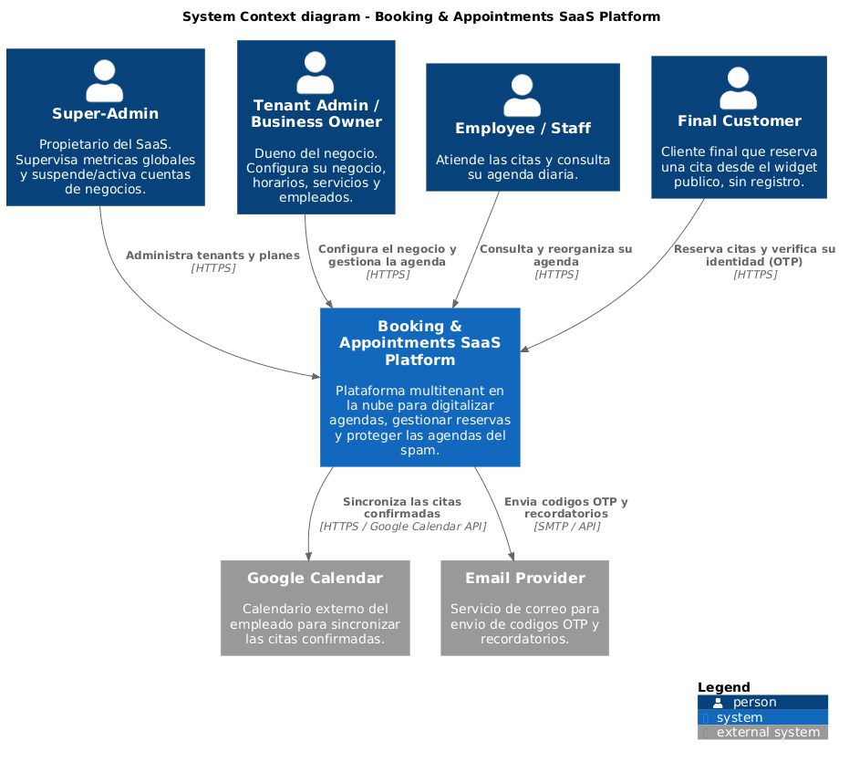

#### C2 - Contenedores

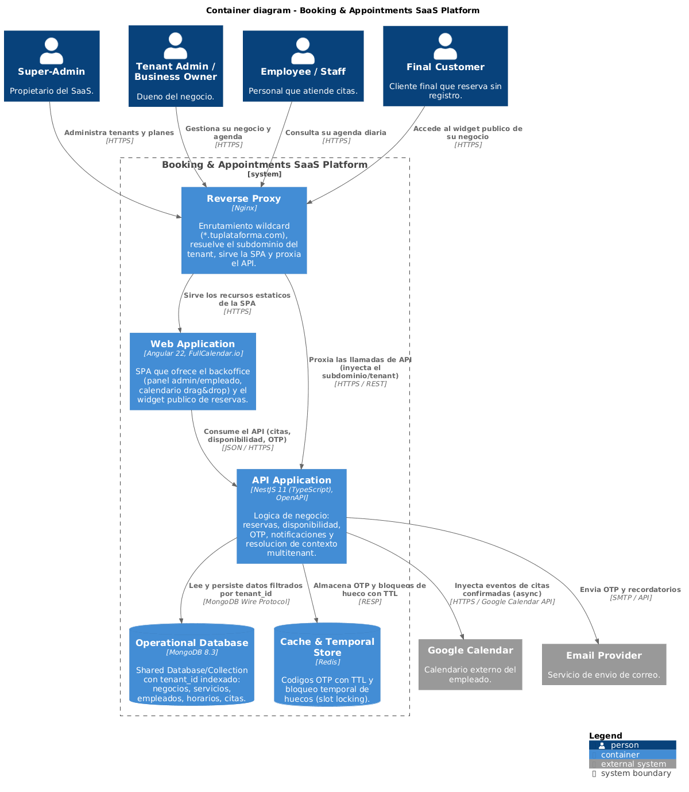

#### C3 - Componentes del API

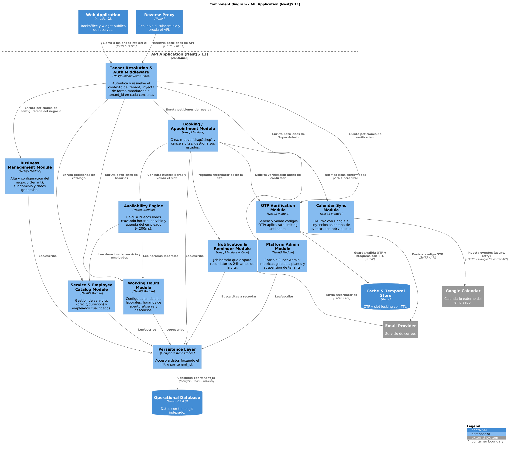

### **3.3. Componentes principales**

A continuación se describen los componentes principales del sistema, agrupados según los tres niveles del modelo C4.

#### Actores y sistemas externos (C1)

- **Super-Admin**: propietario del SaaS. Supervisa las métricas globales del ecosistema y activa o suspende las cuentas de los negocios (tenants). Interactúa con la plataforma vía HTTPS.
- **Tenant Admin / Business Owner**: dueño del negocio. Configura su negocio, los horarios laborales (`WorkingHours`), el catálogo de servicios (`Service`) y los empleados (`Employee`), y gestiona la agenda. Acceso vía HTTPS al backoffice.
- **Employee / Staff**: personal que atiende las citas. Consulta y reorganiza su agenda diaria (drag & drop) y puede sincronizar sus citas con su calendario externo.
- **Final Customer**: cliente final que reserva una cita (`Appointment`) desde el widget público, sin necesidad de registro, y verifica su identidad mediante un código OTP.
- **Google Calendar** *(externo)*: calendario personal del empleado donde se inyectan las citas confirmadas mediante la Google Calendar API.
- **Email Provider** *(externo)*: servicio de correo usado para el envío de códigos OTP y de recordatorios de citas.

#### Contenedores (C2)

- **Reverse Proxy** *(Nginx)*: punto de entrada del sistema. Acepta enrutamiento wildcard (`*.tuplataforma.com`), resuelve el subdominio del tenant, sirve los recursos estáticos de la SPA y proxia las llamadas al API. Es la pieza que habilita el acceso público por subdominio.
- **Web Application** *(Angular 22, FullCalendar.io)*: SPA única que ofrece tanto el backoffice (panel de administración/empleado con calendario interactivo) como el widget público de reservas. Consume el API vía JSON/HTTPS.
- **API Application** *(NestJS 11, TypeScript, OpenAPI)*: núcleo de la lógica de negocio. Gestiona reservas, cálculo de disponibilidad, verificación OTP, notificaciones y la resolución de contexto multitenant. Expone una API REST documentada con OpenAPI.
- **Operational Database** *(MongoDB 8.3)*: base de datos documental con enfoque *Shared Database/Collection*. Persiste negocios, servicios, empleados, horarios y citas, con el campo `tenant_id` indexado para garantizar el aislamiento de datos entre tenants.
- **Cache & Temporal Store** *(Redis)*: almacén temporal que guarda los códigos OTP con su TTL y gestiona el bloqueo temporal de huecos (`SlotLocking`) durante el flujo de verificación de reserva.

#### Componentes internos clave de la API (C3)

- **Tenant Resolution & Auth Middleware**: autentica las peticiones y resuelve el contexto del tenant, inyectando de forma mandatoria el `tenant_id` en todas las consultas. Es la defensa central frente a la fuga de datos inter-tenant.
- **Business Management Module**: alta y configuración del negocio (tenant), subdominio y datos generales. Persiste a través de la capa de persistencia.
- **Working Hours Module**: configuración de días laborales, horarios de apertura/cierre y descansos, que acotan la disponibilidad pública.
- **Service & Employee Catalog Module**: gestión de los servicios (precio y duración) y de los empleados cualificados para realizarlos.
- **Availability Engine**: calcula los huecos libres (`TimeSlot`) cruzando los horarios laborales, la duración del servicio y la agenda del empleado, con un objetivo de respuesta inferior a 200 ms.
- **Booking / Appointment Module**: crea, mueve (drag & drop) y cancela citas, y gestiona sus estados (`Pending` / `Confirmed` / `Cancelled`). Orquesta la verificación OTP, los recordatorios y la sincronización de calendario.
- **OTP Verification Module**: genera y valida los códigos OTP de un solo uso apoyándose en Redis (TTL), y aplica rate limiting para evitar el abuso anti-spam.
- **Notification & Reminder Module**: job planificado (cron horario) que dispara los recordatorios por email 24 horas antes de cada cita confirmada, reduciendo los *no-shows*.
- **Calendar Sync Module**: gestiona la autenticación OAuth2 con Google e inyecta de forma asíncrona los eventos de las citas confirmadas en el calendario externo, con una cola de reintentos (`RetryQueue`) ante fallos de la API.
- **Platform Admin Module**: da soporte a la consola del Super-Admin con las métricas globales, la gestión de planes y la suspensión de tenants.
- **Persistence Layer** *(Mongoose Repositories)*: capa de acceso a datos que fuerza el filtrado por `tenant_id` en cada operación contra MongoDB.

### **3.4. Diagramas de análisis**

Diagramas de clases de análisis (patrón BCE = MVC) de la fase de Elaboración de RUP, acotados a las historias de usuario seleccionadas (HU1–HU4). Separan las clases en tres capas: vistas (`boundary`), controladores (`control`) y modelo del dominio (`entity`).

Versión 1: muestra **únicamente** la separación en las tres capas MVC, sin actores ni relaciones.
Permite identificar de un vistazo a qué capa pertenece cada clase, sin el ruido de las transiciones.

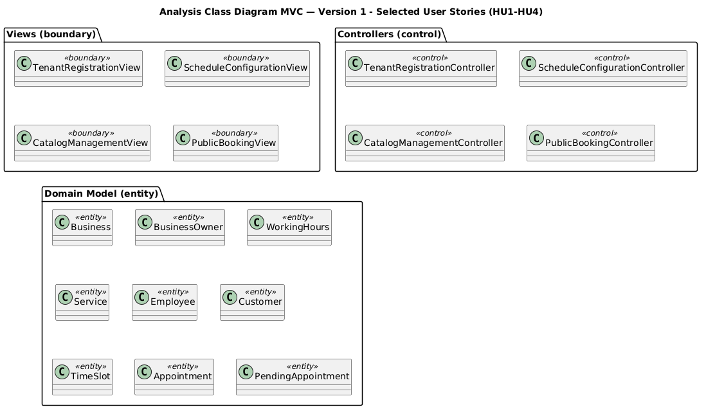

Versión 2: añade los actores y las transiciones entre capas (actor → vista → controlador → modelo) y las relaciones del modelo de dominio.
Refleja cómo colaboran las clases para realizar cada caso de uso, manteniendo los mismos nombres que el modelo de dominio.

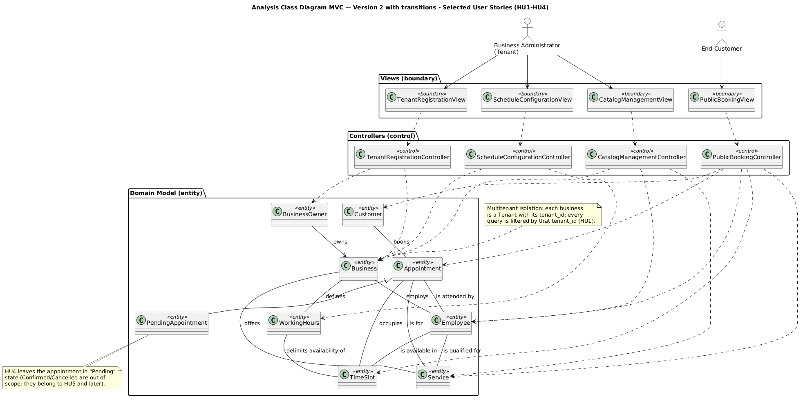

### **3.5. Diagramas de diseño**

Diagramas de la **fase de Construcción** de RUP, que refinan los diagramas de análisis
(apartado 3.4) al nivel de **diseño**: ya son **específicos del stack** (Angular 22 en la capa
`boundary`; NestJS 11 con `Controller` → `Service` → `Repository` Mongoose y `DTOs`; documentos
MongoDB) e incluyen **tipos, visibilidad (`+ - #`) y multiplicidades**. Todos están **acotados a
las historias de usuario seleccionadas (HU1–HU4)**; los módulos fuera de alcance (OTP/HU5,
recordatorios, Calendar Sync, Super-Admin) aparecen solo como **frontera**.

#### 3.5.1. Diagrama de clases de diseño (Vista Lógica)

Dado el volumen de clases y relaciones, el diagrama de clases se ha dividido en un **diagrama
superior de paquetes** (índice) y un **diagrama de detalle por cada paquete**. Cada diagrama de
paquete muestra sus clases con todo el detalle y referencia a los colaboradores de otros
paquetes como *stubs* con el estereotipo `<<from X>>`, para no recargar la vista. Los nombres
del dominio son idénticos a los del modelo de dominio para mantener la trazabilidad.

**Vista superior — paquetes y dependencias**

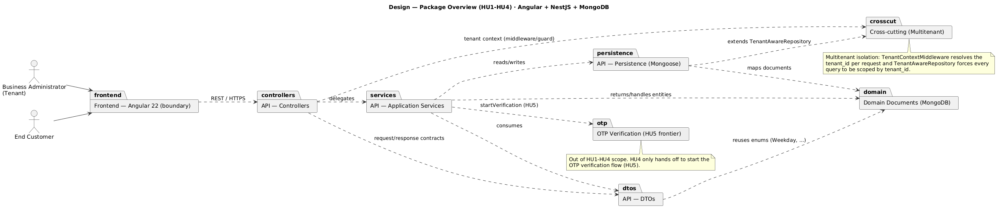

**Paquete Frontend (Angular 22, `boundary`)** — un componente por HU y el `HttpApiClient` compartido que consume el API por REST/HTTPS.

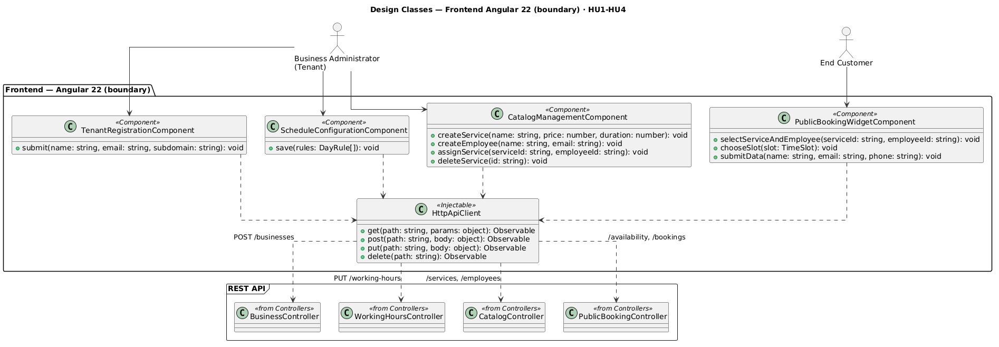

**Paquete Controllers (NestJS)** — los 4 controladores REST y sus operaciones (endpoints) por HU.

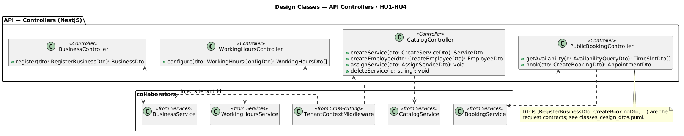

**Paquete Application Services** — lógica de negocio: `BusinessService`, `WorkingHoursService`, `CatalogService`, `BookingService`, `AvailabilityEngineService`, `SlotLockService` y la frontera OTP (HU5).

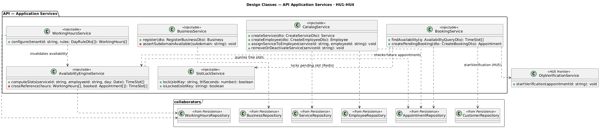

**Paquete DTOs (validación)** — contratos de petición/respuesta con composición (p. ej. `WorkingHoursConfigDto *-- DayRuleDto`).

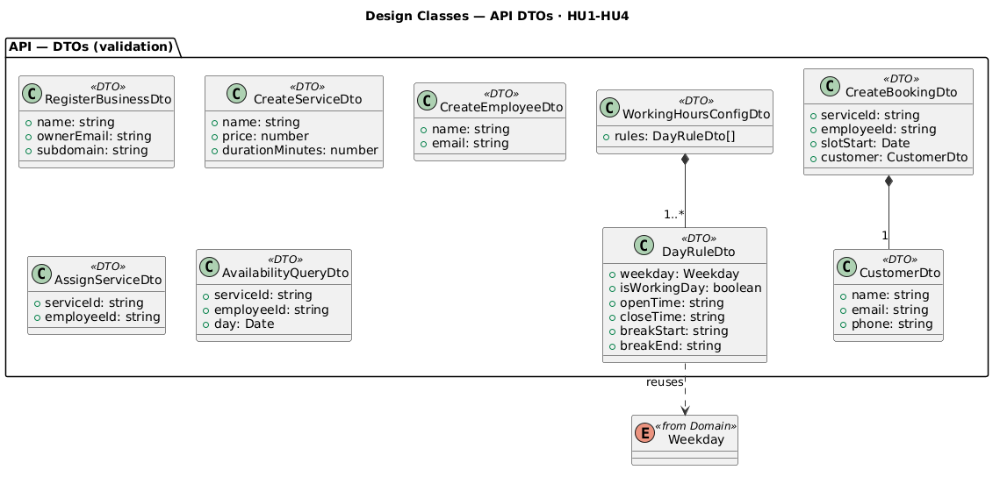

**Paquete Persistence (Mongoose)** — repositorios que heredan de `TenantAwareRepository` (filtro `tenant_id`) y mapean documentos.

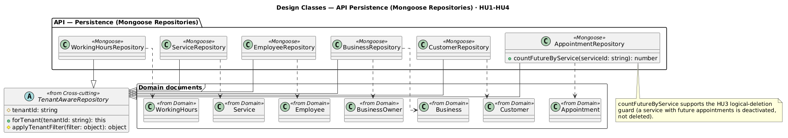

**Paquete Cross-cutting (multitenant)** — `TenantContextMiddleware` y `TenantAwareRepository`, defensa central frente a fugas inter-tenant.

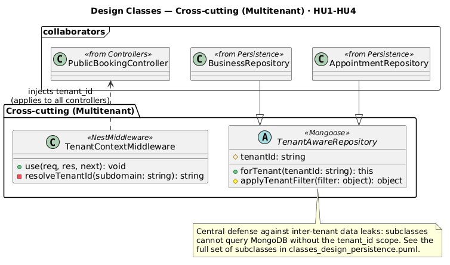

**Paquete Domain Documents (MongoDB)** — documentos y enums (`Business`, `WorkingHours`, `Service`, `Employee`, `Customer`, `Appointment`, `TimeSlot`…) con todas las asociaciones y multiplicidades.

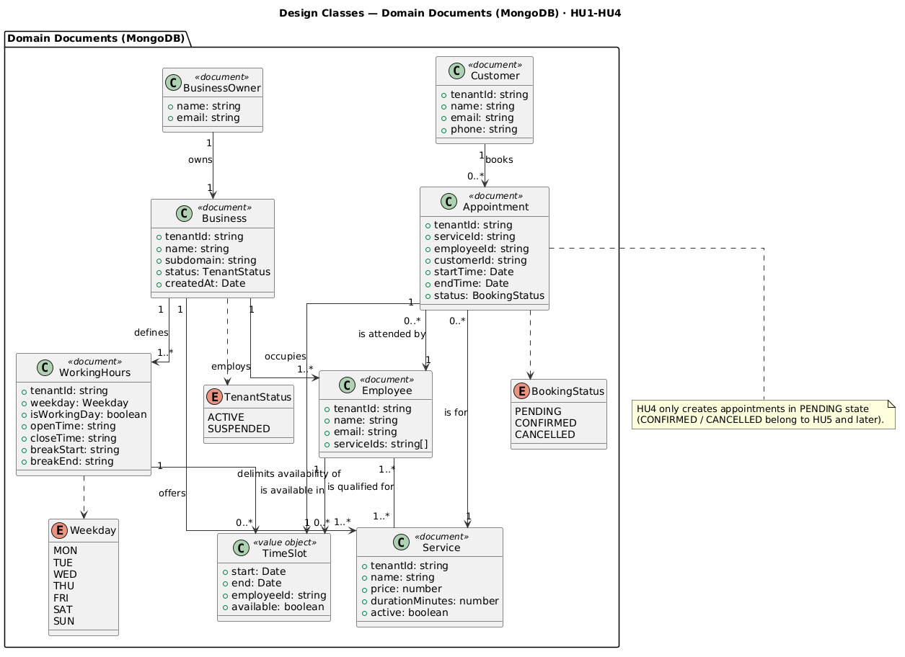

#### 3.5.2. Diagramas de secuencia (Vista Lógica / Proceso)

Un diagrama por historia de usuario, que refina su máquina de estados (apartado 2.6) con las
capas del stack (Angular → Controller → Service → Repository → MongoDB/Redis). Modelan el
**flujo principal y las alternativas clave** (`alt`/`opt`) derivadas de los criterios de
aceptación (BDD).

**HU1 — Registro de negocio** — alta correcta y alternativa de subdominio ocupado (409, sin registro parcial).

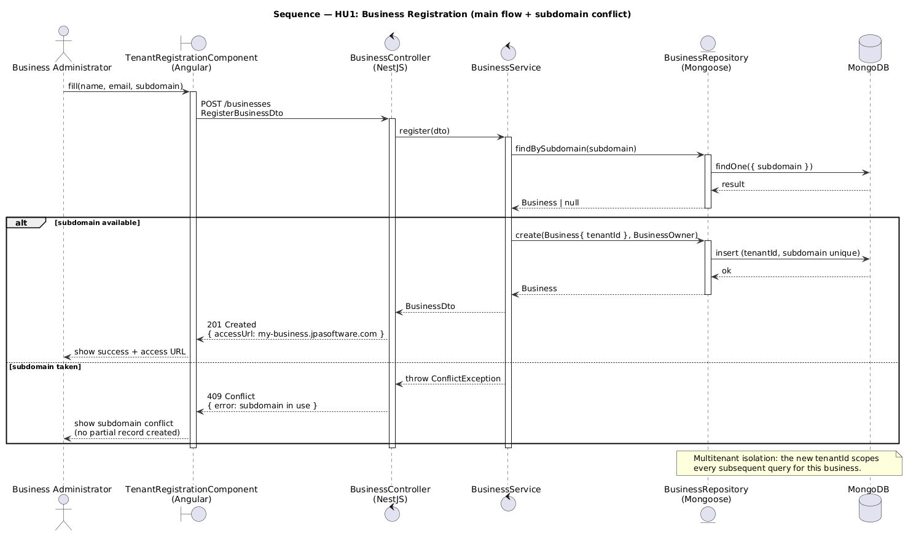

**HU2 — Configuración de la agenda** — guardado de reglas, actualización del motor de disponibilidad y modificación de horario.

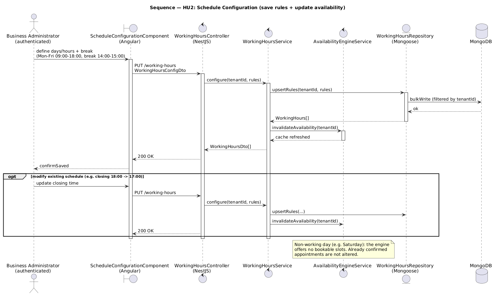

**HU3 — Gestión del catálogo** — alta de servicio/empleado, asignación y guarda de borrado lógico (desactivación si hay citas futuras).

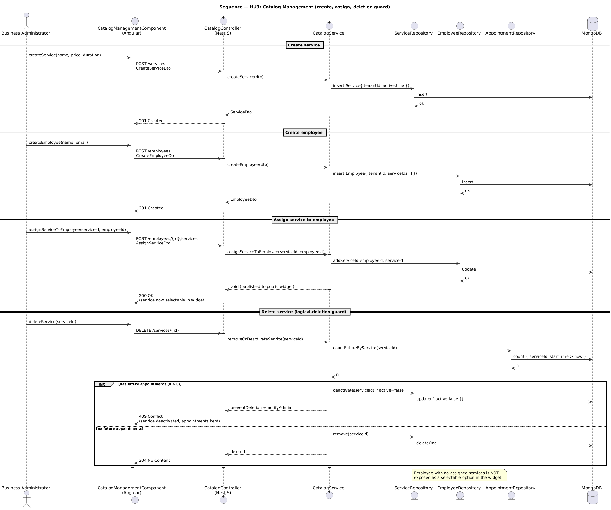

**HU4 — Reserva pública** — disponibilidad (<200 ms), validación de datos, bloqueo del hueco en **Redis**, cita en estado `Pending` y traspaso a la verificación OTP (HU5); incluye la alternativa de conflicto por concurrencia.

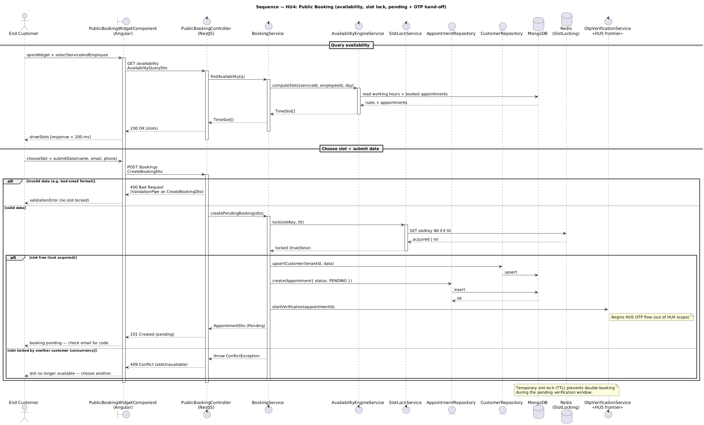

#### 3.5.3. Diagrama de componentes (Vista de Desarrollo)

Componentes NestJS de HU1–HU4 con sus **interfaces provista/requerida** (notación bola-y-zócalo).
Complementa el C3 (apartado 3.2) restringiéndolo a las historias seleccionadas; OTP y Email
aparecen como frontera.

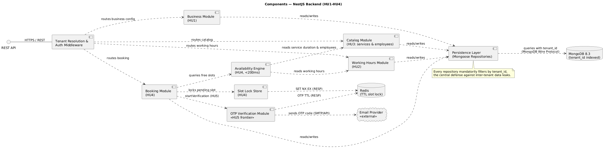

#### 3.5.4. Diagrama de paquetes (Vista de Desarrollo)

Organización del código de frontend y backend en capas con **dependencias acíclicas** (Dependency
Inversion): `presentation → application → domain ← infrastructure`, más `common` transversal. El
frontend depende del backend únicamente a través del contrato REST.

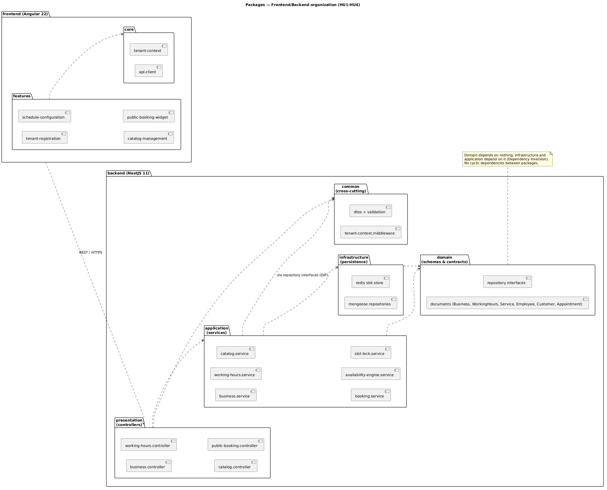

> El **diagrama de despliegue** (Vista Física), también de la fase de diseño, se documenta en el
> apartado [3.7. Infraestructura y despliegue](#37-infraestructura-y-despliegue).

### **3.6. Estructura de ficheros**

> Representa la estructura del proyecto y explica brevemente el propósito de las carpetas principales, así como si obedece a algún patrón o arquitectura específica.

### **3.7. Infraestructura y despliegue**

El **diagrama de despliegue** (Vista Física de RUP) refleja la topología de producción acotada a
las historias de usuario seleccionadas (HU1–HU4). Reproduce la pila de contenedores del C4
(apartado 3.2) —Nginx, SPA Angular, API NestJS, MongoDB y Redis— indicando en cada conexión su
**protocolo**. Google Calendar y el cron de recordatorios (HU7/HU8) quedan fuera de alcance; el
`Email Provider` aparece solo como **frontera** del traspaso OTP hacia HU5.

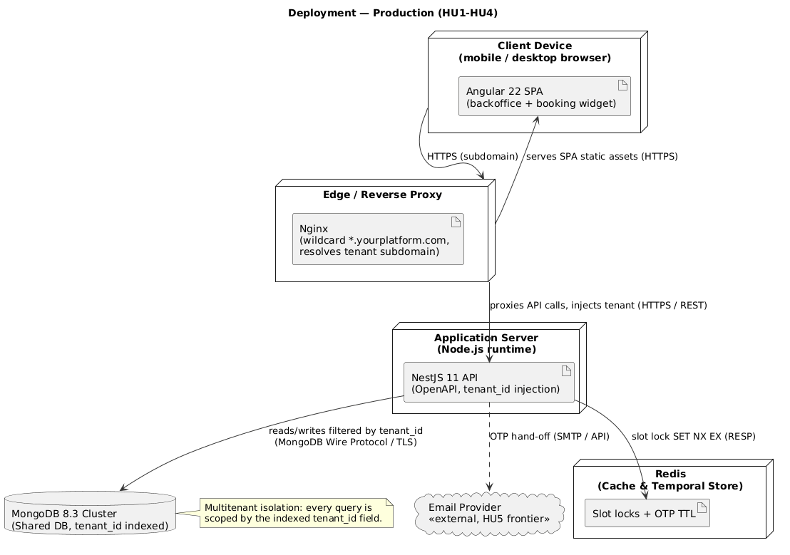

**Nodos y artefactos:**

- **Client Device** *(navegador móvil/escritorio)*: ejecuta la **SPA Angular 22** (backoffice + widget público de reservas).
- **Edge / Reverse Proxy** *(Nginx)*: resuelve el enrutamiento wildcard `*.jpasoftware.com`, identifica el subdominio del tenant, sirve los estáticos de la SPA y proxia el API.
- **Application Server** *(runtime Node.js)*: aloja la **API NestJS 11** (OpenAPI), que inyecta el `tenant_id` en cada petición.
- **MongoDB 8.3 Cluster**: base documental *Shared DB* con el campo `tenant_id` indexado que garantiza el aislamiento entre tenants.
- **Redis** *(Cache & Temporal Store)*: mantiene los bloqueos temporales de huecos (`SlotLocking`) y, en HU5, los códigos OTP con TTL.
- **Email Provider** *(externo, frontera HU5)*: destino del traspaso OTP iniciado al final de HU4.

**Rutas de comunicación (protocolos):**

- `Client → Nginx`: **HTTPS** (por subdominio).
- `Nginx → SPA`: sirve estáticos por **HTTPS**; `Nginx → API`: proxia e inyecta el tenant por **HTTPS/REST**.
- `API → MongoDB`: **MongoDB Wire Protocol / TLS**, con todas las consultas filtradas por `tenant_id`.
- `API → Redis`: **RESP** (`SET NX EX` para el bloqueo de huecos).
- `API → Email Provider`: **SMTP/API** (traspaso OTP, frontera HU5).

**Proceso de despliegue:** la SPA Angular se compila a estáticos y se publica tras el reverse
proxy; la API NestJS se despliega como servicio Node.js; MongoDB y Redis actúan como servicios de
datos. El enrutamiento wildcard en Nginx permite dar de alta nuevos tenants sin cambios de
infraestructura, manteniendo el aislamiento por `tenant_id` en la capa de persistencia.

