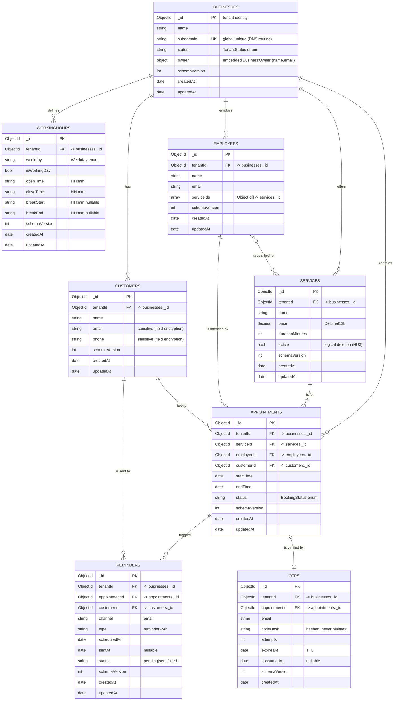

[<- Volver al README principal](../readme.md)

## 4. Modelo de Datos

Modelo de datos **canónico** para MongoDB 8.3 del SaaS multitenant de reservas. Derivado del
modelo del dominio (`system_architecture/domain_model/domain_model.puml`, `glossary.txt`) y de la
vista de diseño (`classes_design_domain.puml`, `classes_design_persistence.puml`). Las decisiones
siguen las rules `.claude/rules/mongodb-*.md` (única fuente de verdad).

Convenciones aplicadas a todas las colecciones de negocio:

- **Multitenancy (modelo pool)**: una base, colecciones compartidas discriminadas por
  `tenantId: ObjectId` (referencia a `businesses._id`). `tenantId` es la **primera clave** de todo
  índice de negocio. Excepción documentada: la colección `businesses` es el **registro de tenants**,
  su discriminador es su propio `_id` (ver más abajo).
- **Tipos BSON**: `ObjectId` para claves/refs; `Date` UTC para instantes; `Decimal128` para dinero;
  `int` para enteros; `string` para enums cerrados y horas `HH:mm`.
- **Auditoría y evolución**: `createdAt`/`updatedAt` (`Date`) y `schemaVersion` (`int`, actual `1`)
  en toda colección de negocio.
- **Validación**: cada colección se crea con validador `$jsonSchema`
  (`validationLevel: "strict"`, `validationAction: "errorAndLog"`).
- **Enums** (de `classes_design_domain.puml`): `TenantStatus = {active, suspended}`,
  `Weekday = {mon,tue,wed,thu,fri,sat,sun}`, `BookingStatus = {pending, confirmed, cancelled}`.

### 4.1. Diagrama del modelo de datos

> **`TimeSlot` no es una colección.** En `classes_design_domain.puml` es un `<<value object>>`
> (`start`, `end`, `employeeId`, `available`) que el `AvailabilityEngineService` **calcula en
> memoria** cruzando `workingHours` y `appointments`; no se persiste. Por eso no aparece como
> colección en el ER.

### 4.2. Descripción de entidades principales

Para cada entidad se indica la decisión **embed/reference** (FNBC + patrones de acceso), los campos
y tipos BSON, las restricciones y los índices (con nombre; guía ESR, `tenantId` primero).

#### `businesses` (agregado raíz — registro de tenants)

- **Decisión**: colección propia. `BusinessOwner` (1-1, `owns`) se **embebe** como sub-documento
  `owner { name, email }`: es una composición "posee-a" sin identidad ni ciclo de vida propio, se
  lee y escribe siempre con el negocio (alta HU1). En `classes_design_persistence.puml` el mismo
  `BusinessRepository` mapea `Business` **y** `BusinessOwner`, coherente con el embebido.
- **Identidad de tenant**: `_id` **es** el `tenantId`. No se duplica un campo `tenantId` dentro de
  `businesses` (evita dependencia transitiva, 3FN/FNBC). El `Business.tenantId` del diagrama de
  diseño se materializa como `businesses._id`; el resto de colecciones lo referencian como
  `tenantId`.
- **Campos**: `name: string`, `subdomain: string`, `status: string` (`TenantStatus`),
  `owner: { name: string, email: string }`, `schemaVersion: int`, `createdAt`/`updatedAt: date`.
- **Restricciones**: `subdomain` **único global** (clave de enrutamiento DNS wildcard, HU1); es la
  **excepción justificada** a "unicidad por tenant" de `mongodb-multitenancy.md` §4, porque esta
  colección define los propios tenants.
- **Índices**:
  - `uq_subdomain` = `{ subdomain: 1 }` unique (global).
  - `idx_status` = `{ status: 1 }` (listado/suspensión Super-Admin, HU9).

#### `workingHours` (reglas de jornada semanal)

- **Decisión**: **colección referenciada** (no embebida en `businesses`). Aunque es un 1-N acotado
  (máx. 7 reglas) que el modelado por defecto embebería, la vista de diseño define un
  `WorkingHoursRepository` y un `WorkingHoursService.configure(): WorkingHours[]` propios, y el
  `AvailabilityEngineService` consulta estas reglas de forma independiente por `(tenantId, weekday)`
  y las actualiza sin tocar el negocio (HU2 "modificación de horario existente"). Ese patrón de
  acceso y actualización independiente justifica referenciar. *(Alternativa considerada: array
  acotado embebido en `businesses`; descartada por coherencia con el diseño de persistencia.)*
- **Campos**: `tenantId: ObjectId`, `weekday: string` (`Weekday`), `isWorkingDay: bool`,
  `openTime/closeTime: string "HH:mm"`, `breakStart/breakEnd: string "HH:mm"` (opcionales),
  `schemaVersion`, auditoría.
- **Restricciones**: una regla por día y tenant.
- **Índices**: `uq_tenant_weekday` = `{ tenantId: 1, weekday: 1 }` unique.

#### `services` (catálogo de prestaciones)

- **Decisión**: colección propia (entidad con ciclo de vida, compartida por muchas citas y
  empleados). Precio como **`Decimal128`** (el diagrama dice `number`; la rule
  `mongodb-schema-conventions.md` §2 obliga `Decimal128` para dinero — prevalece la rule).
- **Campos**: `tenantId: ObjectId`, `name: string`, `price: decimal`, `durationMinutes: int`,
  `active: bool` (borrado lógico HU3: un servicio con citas futuras se **desactiva**, no se borra),
  `schemaVersion`, auditoría.
- **Índices**: `idx_tenant_active` = `{ tenantId: 1, active: 1 }` (catálogo visible en el widget).

#### `employees` (personal)

- **Decisión**: colección propia. La relación N-M `Employee is qualified for Service` se modela con
  un **array acotado de referencias** `serviceIds: ObjectId[]` en el empleado (cardinalidad pequeña
  y acotada; se lee al calcular disponibilidad). Fuente de verdad del vínculo: `employees.serviceIds`.
- **Campos**: `tenantId: ObjectId`, `name: string`, `email: string`, `serviceIds: ObjectId[]`,
  `schemaVersion`, auditoría.
- **Índices**:
  - `uq_tenant_email` = `{ tenantId: 1, email: 1 }` unique.
  - `idx_tenant_serviceIds` = `{ tenantId: 1, serviceIds: 1 }` (multikey; "empleados capacitados
    para un servicio", HU3/HU4).

#### `customers` (clientes finales)

- **Decisión**: colección propia (referenciada por citas y recordatorios; se reutiliza por email en
  reservas sucesivas). Datos de contacto **sensibles** (`email`, `phone`): candidatos a **cifrado a
  nivel de campo** (Queryable Encryption, `mongodb-security.md` §2), con consultas de igualdad por
  `email`.
- **Campos**: `tenantId: ObjectId`, `name: string`, `email: string`, `phone: string`,
  `schemaVersion`, auditoría.
- **Índices**: `uq_tenant_email` = `{ tenantId: 1, email: 1 }` unique (deduplica el cliente por
  tenant al reservar, HU4).

#### `appointments` (citas — agregado transaccional)

- **Decisión**: colección propia (many, ciclo de vida propio `pending → confirmed/cancelled`). Se
  usan **referencias normalizadas** `serviceId`/`employeeId`/`customerId` (coherente con
  `classes_design_domain.puml`, que no embebe snapshots). *(Extended Reference —duplicar
  `serviceName`/`price`— queda como optimización futura opcional; si se adopta, exige declarar
  fuente de verdad `services` y su propagación según `mongodb-normalization-fnbc.md` §4.)*
- **Campos**: `tenantId`, `serviceId`, `employeeId`, `customerId: ObjectId`;
  `startTime`/`endTime: date` (UTC); `status: string` (`BookingStatus`: `pending|confirmed|cancelled`;
  HU4 solo crea `pending`); `schemaVersion`, auditoría.
- **Invariante (no doble reserva)**: un empleado no puede tener dos citas activas en el mismo
  instante. Mecanismo (`mongodb-transactions-and-integrity.md` §2): **índice único parcial** +
  **escritura condicional atómica** (upsert). La atomicidad de documento basta; no requiere
  transacción multi-documento.
- **Índices**:
  - `uq_tenant_employee_startTime` = `{ tenantId: 1, employeeId: 1, startTime: 1 }` **unique**,
    `partialFilterExpression: { status: { $in: ["pending", "confirmed"] } }`. Evita la doble
    reserva permitiendo reusar el hueco si la cita previa fue `cancelled`.
  - `idx_tenant_service_startTime` = `{ tenantId: 1, serviceId: 1, startTime: 1 }` (soporta
    `AppointmentRepository.countFutureByService`, guarda de borrado lógico HU3).

#### `reminders` (recordatorios — HU8, *suposición*)

- **Decisión**: colección propia (efímera-operativa, con estado de envío para idempotencia). El
  cron (cada hora) detecta citas `confirmed` a <24 h y registra aquí el envío para no duplicar.
- **Campos** *(derivados de HU8; no detallados en la vista de diseño HU1-HU4)*: `tenantId`,
  `appointmentId`, `customerId: ObjectId`, `channel: string` (`email`), `type: string`
  (`reminder-24h`), `scheduledFor: date`, `sentAt: date` (nullable), `status: string`
  (`pending|sent|failed`), `schemaVersion`, auditoría.
- **Índices**:
  - `uq_tenant_appointment_type` = `{ tenantId: 1, appointmentId: 1, type: 1 }` unique
    (idempotencia: sin recordatorios duplicados).
  - `idx_tenant_status_scheduledFor` = `{ tenantId: 1, status: 1, scheduledFor: 1 }` (localiza
    envíos pendientes por ventana temporal).

#### `otps` (verificación anti-spam — HU5, *suposición*)

- **Decisión**: colección propia con **expiración TTL** (dato efímero, 5 min). Se guarda el
  **hash** del código, nunca el código en claro (`mongodb-security.md`). El rate-limiting por
  IP/email vive en **Redis**, no aquí.
- **Campos** *(derivados de HU5/glosario; fuera del alcance de la vista de diseño HU1-HU4)*:
  `tenantId`, `appointmentId: ObjectId`, `email: string`, `codeHash: string`, `attempts: int`,
  `expiresAt: date`, `consumedAt: date` (nullable), `schemaVersion`, `createdAt`.
- **Índices**:
  - `ttl_expiresAt` = `{ expiresAt: 1 }`, `expireAfterSeconds: 0` (borrado automático al vencer; el
    barrido corre cada 60 s, por lo que la lógica **también** valida el vencimiento en consulta).
  - `idx_tenant_appointment` = `{ tenantId: 1, appointmentId: 1 }` (recupera el OTP vigente de la
    cita al verificar).

### 4.3. Resumen de decisiones embed vs reference

| Entidad | Colección | Decisión | Justificación |
| :--- | :--- | :--- | :--- |
| Business | `businesses` | raíz; `owner` **embebido** | 1-1 composición, se lee/escribe con el negocio |
| BusinessOwner | (embebido) | **embed** en `businesses` | sin identidad ni ciclo de vida propio |
| WorkingHours | `workingHours` | **reference** | actualización/consulta independiente (diseño + HU2) |
| Service | `services` | **reference** | ciclo de vida propio, compartido por citas/empleados |
| Employee | `employees` | **reference**; `serviceIds[]` | N-M acotada por array de refs |
| Customer | `customers` | **reference** | reutilizado por email; datos sensibles cifrables |
| Appointment | `appointments` | **reference** | many, ciclo de vida propio, invariante no doble reserva |
| TimeSlot | (ninguna) | **no persiste** | value object calculado en memoria |
| Reminder | `reminders` | **reference** | operativo con estado de envío (idempotencia) |
| OTP | `otps` | **reference** + TTL | efímero, hash, expiración automática |
</content>
</invoke>
